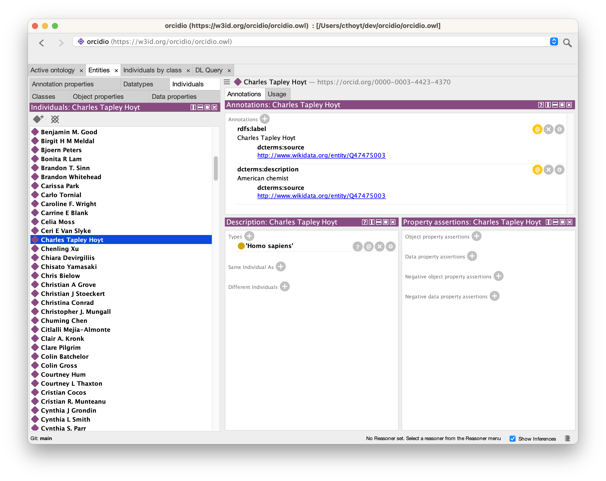
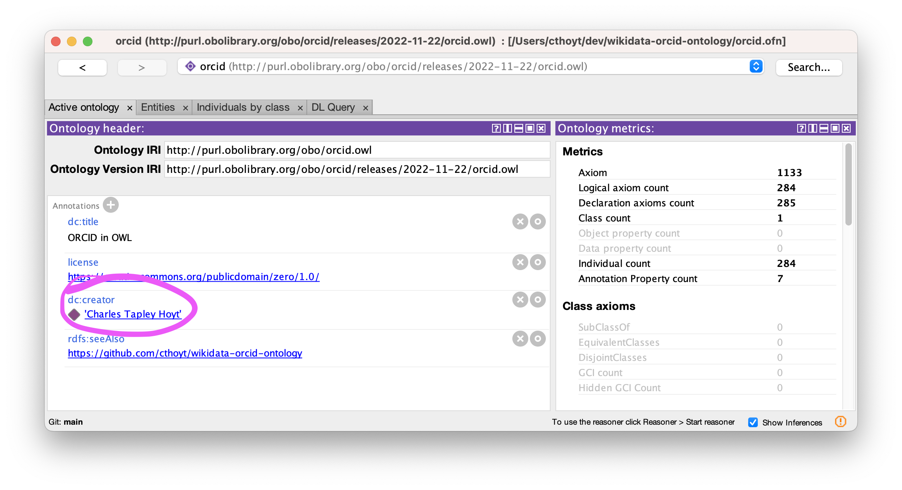

# ORCID in OWL

Motivated by [Bill Duncan's comments](https://obo-communitygroup.slack.com/archives/C01R2D66249/p1669063375689969)
on annotating ORCID identifiers with labels in ontologies, the goal of this repository is to make an OWL
file that has OBO contributors as named individuals.

The PURL for this ontology is https://w3id.org/orcidio/orcidio.owl.

## Screenshot

In this Protege screenshot, you can see that the named individuals are available:



You can see anywhere in Protege you use ORCID URIs, they will get shown with their labels and linked back to the named
individuals.



## How to add more ORCIDs to this ontology

This ontology is not a full dump of ORCID, but rather a subset that is useful for contextualizing structured
contributions in OBO Foundry ontologies. There are a few possibilities for adding additional ORCIDs:

1. Manually add ORCID identifiers to [`extra_orcids.txt`](extra_orcids.txt)
2. Add additional contribution annotations to your favorite ontology's Wikidata page and make sure
   these contributors have ORCID identifiers in their corresponding entries. This isn't recommended, though.
3. Annotate ORCID identifiers to your favorite ontologies using structured predicates, get them released, then
   run `python update_wikidata.py` to parse all OBO ontologies with JSON releases, generate QuickStatements, then update
   Wikidata. (TODO: this could be automated)

## How to import ORCIDIO in your ontology

See the [tutorial](https://oboacademy.github.io/obook/howto/odk-add-orcidio-module/)
in the OBO Academy.

## Build

After installing [`robot`](https://robot.obolibrary.org), you can run the following:

```shell
pip install tox
tox
```

This is run automatically once per week via GitHub
Actions [](https://github.com/cthoyt/orcidio/actions/workflows/update.yml)
or can be triggered on demand (i.e., workflow dispatch).
